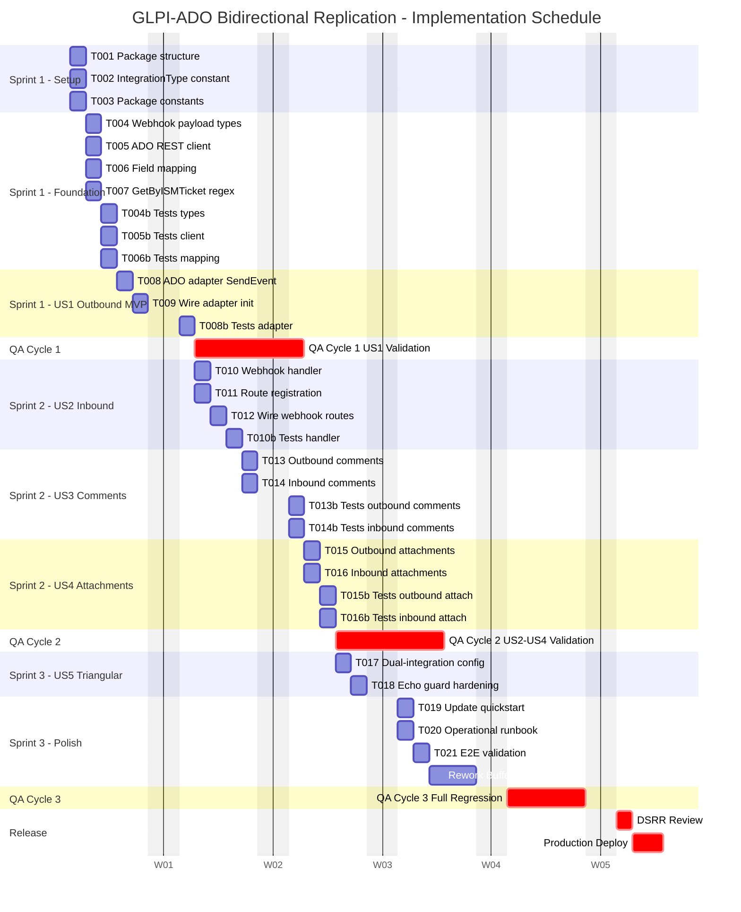

# Implementation Schedule: GLPI–ADO Bidirectional Replication

**Feature**: specs/002-glpi-ado
**Gantt Diagram**: [schedule.mmd](schedule.mmd)

## Gantt Chart

> Replace `2000-01-03` in [schedule.mmd](schedule.mmd) with the actual Monday start date. The `axisFormat W%W` shows week numbers on the axis, not calendar dates.

---

## Assumptions

- 4 hours/day developer capacity (half-day allocation)
- 2-week sprints (10 working days)
- 1-week QA validation cycles
- DSRR + production deploy process after final QA
- Single developer, sequential execution (parallel tasks executed serially)
- All dates relative to **START** (day 0)
- AI-assisted code generation (GitHub Copilot / Claude) — reduces implementation hours by ~40%

---

## Effort Estimates

| Phase                    | Tasks                   | Baseline Hours | AI-Assisted Hours | Working Days (AI) |
| ------------------------ | ----------------------- | -------------- | ----------------- | ----------------- |
| Phase 1: Setup           | T001–T003               | 4h             | 3h                | 1                 |
| Phase 2: Foundational    | T004–T007 + T004b–T006b | 24h            | 14h               | 4                 |
| Phase 3: US1 Outbound    | T008–T009 + T008b       | 14h            | 8h                | 2                 |
| Phase 4: US2 Inbound     | T010–T012 + T010b       | 14h            | 8h                | 2                 |
| Phase 5: US3 Comments    | T013–T014 + T013b–T014b | 10h            | 6h                | 2                 |
| Phase 6: US4 Attachments | T015–T016 + T015b–T016b | 12h            | 7h                | 2                 |
| Phase 7: US5 Triangular  | T017–T018               | 5h             | 3h                | 1                 |
| Phase 8: Polish          | T019–T021               | 6h             | 4h                | 1                 |
| **Total**                | **30 tasks**            | **89h**        | **53h**           | **~15 days**      |

---

## Sprint Plan

### Sprint 1: Setup + Foundation + US1 Outbound (MVP)

**Duration**: START to START+6 (7 working days)

| Day     | Hours | Tasks            | Notes                                                               |
| ------- | ----- | ---------------- | ------------------------------------------------------------------- |
| START   | 4h    | T001, T002, T003 | Package structure + constants (all in one day with AI)              |
| START+1 | 4h    | T004, T007       | Webhook payload types + ISMTicket regex                             |
| START+2 | 4h    | T005             | ADO REST client (AI generates client boilerplate)                   |
| START+3 | 4h    | T006             | Field mapping (AI generates state / priority tables)                |
| START+4 | 4h    | T004b, T005b     | Types + client unit tests                                           |
| START+5 | 4h    | T006b, T008      | Mapping tests + ADO adapter (AI generates echo guard + type filter) |
| START+6 | 4h    | T009, T008b      | Wire adapter init + adapter tests                                   |

**Sprint 1 Output**: MVP — outbound KPSS→ADO replication functional

**Capacity**: 28h available / 25h planned = **89% utilization**

---

### QA Cycle 1

**Duration**: START+7 to START+13 (5 working days)

- Validate outbound replication end-to-end
- Create ticket via KPSS API → verify ADO Issue created
- Update ticket state → verify ADO Issue state updates
- Verify echo guard prevents loops
- Bug fixes from validation

---

### Sprint 2: US2 Inbound + US3 Comments + US4 Attachments

**Duration**: START+7 to START+12 (6 working days, overlaps with QA Cycle 1)

| Day      | Hours | Tasks        | Notes                                                                 |
| -------- | ----- | ------------ | --------------------------------------------------------------------- |
| START+7  | 4h    | T010, T011   | Webhook handler + route registration (AI generates handler structure) |
| START+8  | 4h    | T012, T010b  | Wire routes + handler tests                                           |
| START+9  | 4h    | T013, T014   | Outbound + inbound comments                                           |
| START+10 | 4h    | T013b, T014b | Comment tests                                                         |
| START+11 | 4h    | T015, T016   | Outbound + inbound attachments                                        |
| START+12 | 4h    | T015b, T016b | Attachment tests                                                      |

**Sprint 2 Output**: Full bidirectional sync — tickets, comments, attachments

**Capacity**: 24h available / 21h planned = **88% utilization**

---

### QA Cycle 2

**Duration**: START+13 to START+19 (5 working days)

- Validate inbound ADO→KPSS replication
- Test comment and work note bidirectional sync
- Test attachment upload/download with SHA-256 dedup
- Verify constant-time auth comparison
- Bug fixes from validation

---

### Sprint 3: US5 Triangular + Polish + Rework Buffer

**Duration**: START+13 to START+18 (6 working days, overlaps with QA Cycle 2)

| Day         | Hours | Tasks            | Notes                                          |
| ----------- | ----- | ---------------- | ---------------------------------------------- |
| START+13    | 4h    | T017, T018       | Dual-integration config + echo guard hardening |
| START+14    | 4h    | T019, T020, T021 | Quickstart, runbook, E2E validation            |
| START+15–17 | 12h   | Rework Buffer    | QA bug fixes, edge cases, polish (3 days)      |

**Sprint 3 Output**: Feature complete with documentation

**Capacity**: 24h available / 19h planned = **79% utilization**

---

### QA Cycle 3: Full Regression

**Duration**: START+19 to START+25 (5 working days)

- Full regression across all 5 user stories
- Triangular sync validation (GLPI ↔ KPSS ↔ ADO)
- Performance validation under load
- Security review (PAT handling, auth, injection prevention)

---

### Release

| Milestone         | Day                  | Activity                                 |
| ----------------- | -------------------- | ---------------------------------------- |
| DSRR Review       | START+26             | Design/Security/Release Readiness review |
| Production Deploy | START+27 to START+28 | Staged rollout to production             |

---

## Timeline Summary

| Milestone           | Day                  | Description                         |
| ------------------- | -------------------- | ----------------------------------- |
| START               | START                | Development begins                  |
| Foundation Complete | START+4              | Phase 1 + Phase 2 done              |
| MVP (Outbound)      | START+6              | US1 complete — outbound replication |
| QA Cycle 1          | START+7 to START+13  | Outbound validation                 |
| Bidirectional Core  | START+8              | US2 complete — inbound replication  |
| Full Sync           | START+12             | US3 + US4 complete                  |
| QA Cycle 2          | START+13 to START+19 | Full sync validation                |
| Feature Complete    | START+14             | US5 + Polish done                   |
| QA Cycle 3          | START+19 to START+25 | Full regression                     |
| DSRR                | START+26             | Release readiness                   |
| Production          | START+28             | Live in production                  |

---

## Risk Factors

| Risk                                  | Impact | Likelihood | Mitigation                                                     |
| ------------------------------------- | ------ | ---------- | -------------------------------------------------------------- |
| ADO API behavior differs from docs    | HIGH   | MEDIUM     | Research.md covers key areas; spike in Sprint 1 if needed      |
| ISMTicket regex performance at scale  | MEDIUM | LOW        | MongoDB index on `latest.u_1x_ism_ticket`; monitor query times |
| PAT rotation during development       | LOW    | MEDIUM     | Document rotation procedure in runbook (T020)                  |
| QA cycle reveals architectural issues | HIGH   | LOW        | MVP checkpoint at START+9 validates core design early          |
| Triangular echo loop edge case        | HIGH   | MEDIUM     | Dedicated hardening task (T018) + E2E validation (T021)        |

---

## Capacity Utilization

| Sprint                          | Available Hours | Planned Hours | Buffer Hours | Utilization |
| ------------------------------- | --------------- | ------------- | ------------ | ----------- |
| Sprint 1 (7 days)               | 28h             | 25h           | 3h           | 89%         |
| Sprint 2 (6 days)               | 24h             | 21h           | 3h           | 88%         |
| Sprint 3 (6 days, incl. rework) | 24h             | 19h           | 5h           | 79%         |
| **Total**                       | **76h**         | **65h**       | **11h**      | **86%**     |

> AI assistance reduces total implementation from 89h (baseline) to 53h. Sprint 3 includes 12h of explicit rework buffer to absorb QA-discovered issues from Cycles 1–3.
